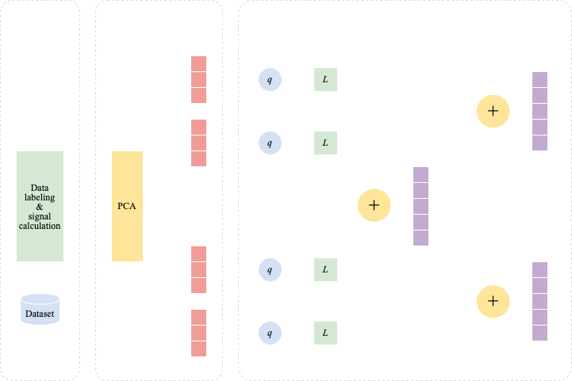

+++
title = "Forecasting stock movement using principal component analysis and hyperdimensional computing"
description = "Stock movement prediction project"
date = "2023-11-27"
aliases = ["stock prediction hypervectors"]
author = "Benjamin Hong"
math = true
+++

### » Introduction
Forecasting stock price movement is a problem that investors and researchers have long been tackling. This is a challenging task due to the wide variety of factors that impact stock prices, which span from exchange rates to monetary policy to current events. Being able to accurately predict the movement of prices would generate large amounts of profit, making this research area of high interest for investors and researchers alike. Many traditional methods of time series forecasting that are popular in finance, such as logistic regression and ARIMA, are based on the assumption that values come from a linear process. However, this is a vast oversimplification, resulting in inaccurate predictions for nonlinear stock price movements. For this reason, newer approaches like deep learning methods have been gaining popularity recently due to their ability to capture nonlinear processes.

In particular, neural network architectures such as CNNs, RNNs, and LSTMs have shown promising results. Yang et al. [1] details a state-of-the-art model which combines a CNN and an LSTM to predict the direction of price movements. By using the CNN for feature extraction and LSTM for prediction, this hybrid model is able outperform other models such as ANN, SVM, and CNN. However, this level of performance is achieved through using a large number of neurons that scales upwards as the number of features increases. As a result, these models are computationally expensive and require large amounts of memory. The complexity of these models also result in high training times, since each iteration of the training process requires applying all of the training data to the model and updating parameters using gradient descent. Furthermore, the complexity of these models results in a lack of transparency that makes it difficult to decipher how decisions are made.

In this paper, a methodology for stock movement prediction using principal component analysis and hyperdimensional computing is proposed as an alternative to neural network-based methods. HDC is based around performing operations on high-dimensional vectors called hypervectors, which can represent multiple pieces of information within a single entity. If successful, this methodology will be able to achieve similar levels of success as state-of-the-art models with lower training times and higher transparency. Furthermore, HDC is more robust to hardware faults due to the large size of hypervectors, whereas traditional ANNs can be significantly impacted if errors such as bit flips cause changes in data representation. This study aims to create a design that combines the advantages of PCA in feature extraction with the advantages of HDC in classification.

### » Proposed Framework

To implement this, the architecture will consist of four major components: data representation, feature extraction, hypervector encoding, and prediction. This architecture is illustrated below.

#### A. Data Representation

The historical data of the S&P 500 index will be used for this study. Class labels will indicate the direction of stock movement, which will be determined by looking at the daily close prices of the index. Given close price $C_t$ for the $t$-th day, the assigned class label will be
$$\begin{equation} y_t = \begin{cases} 1, & C_{t+1} > C_t, \\ 
0, & \text{otherwise.} \end{cases}\end{equation}$$

$$ y_t=   \left\{
\begin{array}{ll}
      1 & C_{t+1} > C_t \\
      0 & \text{otherwise} \\
\end{array} 
\right.  $$